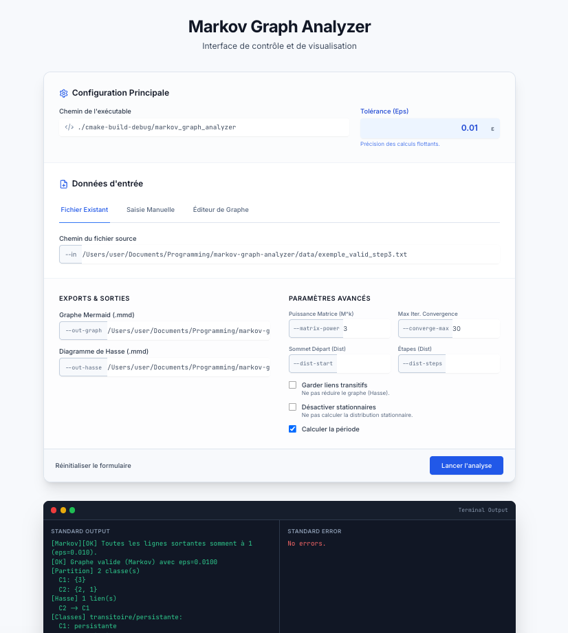

<div id="top">

<!-- HEADER STYLE: CLASSIC -->
<div align="center">


# MARKOV-GRAPH-ANALYZER

<em>Projet d'étude Informatique et Mathématiques</em>

<!-- BADGES -->


</div>
<br>

---

## Table des matières

- **[Aperçu](#overview)**
- **[Fonctionnalités](#features)**
- **[Structure du projet](#project-structure)**
- **[Prise en main](#getting-started)**
    - **[Prérequis](#prerequisites)**
    - **[Installation](#installation)**
    - **[Utilisation](#usage)**
- **[Interface web](#web-ui)**
- **[Tests unitaires](#testing)**

---

## Aperçu <a id="overview"></a>

Ensemble d’outils pour analyser, valider et visualiser des graphes et chaînes de Markov. Combine des algorithmes avec une visualisation intuitive pour aider développeurs et chercheurs à comprendre des structures complexes.

- **🔍 Validation du graphe (Partie 1) :** vérifie les contraintes de Markov (sommes sortantes ≈ 1) à partir des fichiers texte.
- **🌐 Export Mermaid (Partie 1) :** génère des diagrammes Mermaid du graphe brut.
- **🧮 Composantes fortement connexes (Partie 2) :** algorithme de Tarjan + partition des classes.
- **📈 Diagramme de Hasse (Partie 2) :** liens inter-classes avec option de suppression des redondances.
- **📊 Propriétés Markov (Partie 2) :** classes transitoires/persistantes, états absorbants, irréductibilité.
- **🧠 Matrices & distributions (Partie 3) :** puissances de matrices, convergence, distributions stationnaires par classe, périodicité (défi).
- **🌐 Web UI bonus (indépendante & facultative) :** petite interface web pour saisir les arguments, générer un graphe (fichier, texte ou éditeur visuel) et lancer le binaire C.

---

## Fonctionnalités <a id="features"></a>

|      | Composant       | Détails                                                                                     |
| :--- | :-------------- | :------------------------------------------------------------------------------------------ |
| ⚙️  | **Architecture**  | <ul><li>Modulaire (I/O, graphe, Tarjan, Hasse, matrices, périodes)</li><li>CMake pour orchestrer builds et tests</li></ul> |
| 📄 | **Documentation** | <ul><li>Usage CLI simple (voir ci-dessous)</li><li>Tests listés dans `test/README.md`</li></ul> |
| 🧩 | **Tests**       | <ul><li>Sous-répertoires `test/` par étape (Parties 1→3)</li><li>Inclut Tarjan, Hasse, matrices, stationnaires, période</li></ul> |
| 🌐 | **Exports**       | <ul><li>Mermaid du graphe brut (Partie 1)</li><li>Mermaid du Hasse (Partie 2)</li></ul> |
| 📊 | **Analyse**       | <ul><li>Classes transitoires/persistantes, absorbants, irréductibilité (Partie 2)</li><li>Convergence, stationnaires, période (Partie 3)</li></ul> |

---

## Structure du projet <a id="project-structure"></a>

```
└── markov-graph-analyzer/
    ├── CMakeLists.txt
    ├── README.md
    ├── data/
    ├── out/
    ├── webui/
    ├── include
    │   ├── graph.h
    │   ├── io.h
    │   ├── list.h
    │   ├── mermaid.h
    │   ├── scc.h
    │   ├── tarjan.h
    │   ├── utils.h
    │   ├── hasse.h
    │   ├── markov_props.h
    │   ├── mermaid_hasse.h
    │   ├── matrix.h
    │   ├── period.h
    │   └── verify.h
    ├── src
    │   ├── graph.c
    │   ├── io.c
    │   ├── list.c
    │   ├── main.c
    │   ├── mermaid.c
    │   ├── scc.c
    │   ├── tarjan.c
    │   ├── utils.c
    │   ├── hasse.c
    │   ├── markov_props.c
    │   ├── mermaid_hasse.c
    │   ├── matrix.c
    │   └── verify.c
    └── test
        ├── CMakeLists.txt
        ├── README.md
        ├── core/
        ├── io_verify/
        ├── mermaid_cli/
        ├── tarjan_core/
        ├── hasse_links/
        ├── class_analysis_and_export/
        ├── matrix_ops/
        ├── stationary_analysis/
        └── period_analysis/
```

---

## Prise en main <a id="getting-started"></a>

### Prérequis <a id="prerequisites"></a>

- **Langage de programmation :** C
- **Outil de build :** CMake

### Installation <a id="installation"></a>

Construire markov-graph-analyzer depuis les sources et installer les dépendances :

#### 1. **Cloner le dépôt :**

  ```
  git clone https://github.com/Tezay/markov-graph-analyzer
  ```

#### 2. **Aller dans le répertoire du projet :**

  ```
  cd markov-graph-analyzer
  ```

#### 3. **Compiler :**

**Avec [CMake](https://isocpp.org/):**

```
cmake . && make
```

### Utilisation <a id="usage"></a>

Exécuter le projet (CLI couvrant toutes les parties) :

**Avec [CMake](https://isocpp.org/):**

```
./markov-graph-analyzer
```

Options principales :

```
--in FILE            Graphe (format texte Partie 1)
--eps E              Tolérance Markov et convergences (def 0.01)
--out-graph FILE     Export Mermaid du graphe
--out-hasse FILE     Export Mermaid du Hasse (classes)
--keep-transitive    Ne pas retirer les liens transitifs du Hasse
--matrix-power K     Affiche M^K
--converge-max N     Iter max pour diff(M^n, M^{n-1}) < eps (def 30)
--dist-start V       Sommet de départ pour une distribution
--dist-steps T       Nombre d'étapes pour la distribution
--no-stationary      Désactive le calcul des stationnaires par classe
--period             Calcule la période de chaque classe (défi)
```

### Interface web <a id="web-ui"></a>

- Emplacement : `webui/` (Flask + Tailwind CDN).
- Modes de saisie : fichier `--in`, texte brut, ou éditeur de graphe (génère un fichier temporaire en arrière-plan).
- Lancement rapide :
  ```bash
  python3 -m venv .venv
  . .venv/bin/activate # Sur Windows : .venv\Scripts\activate
  pip install flask
  FLASK_APP=webui/app.py flask run
  ```
  puis ouvrez `http://127.0.0.1:5000`. Le binaire C doit être construit et accessible (ex: `./markov_graph_analyzer` ou `./cmake-build-debug/markov_graph_analyzer`).

#### Capture d’écran
  

**Note :** Une partie de l'UI (Tailwind) et du Javascript de l'inteface web a été réalisée avec l'assistance d'IAs génératives, n'étant pas le cœur du projet (optionnel).

### Tests unitaires <a id="testing"></a>

- **Guide des tests : [test/README.md](test/README.md)**
